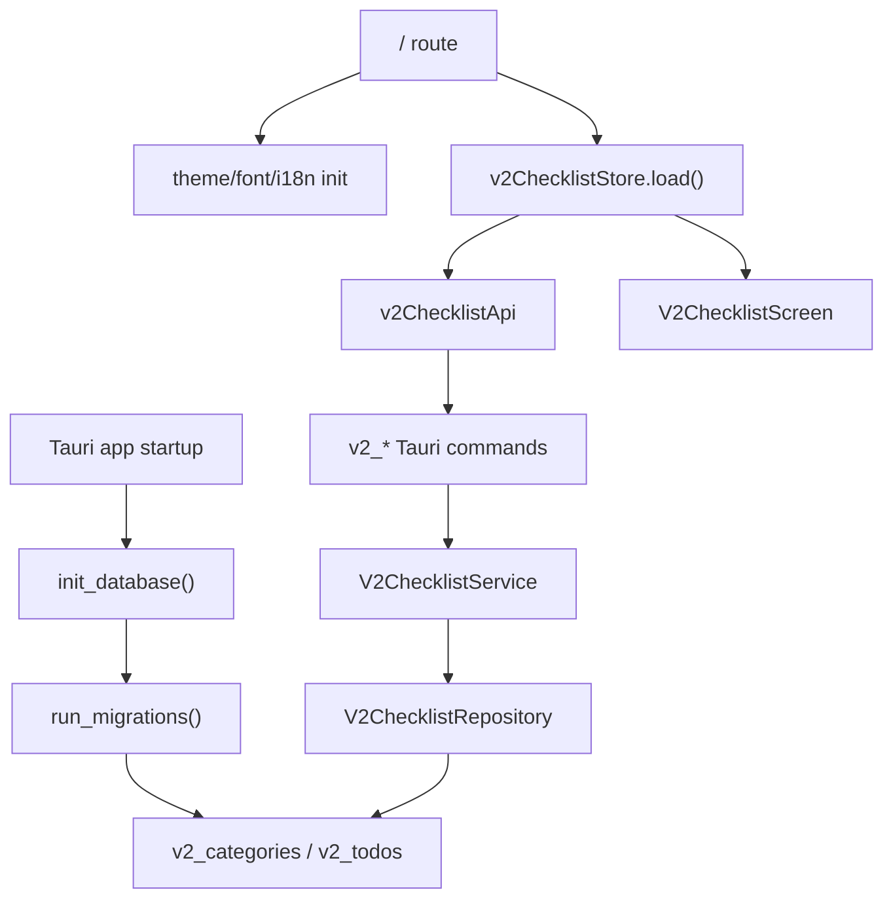

---
{"dg-publish":true,"permalink":"/areas/tickly//","dgPassFrontmatter":true,"dg-note-properties":{}}
---


이 화면은 Tickly를 실행했을 때 보이는 첫 화면이다. 이번 문서에서는 위와 같은 체크리스트 UI가 어떻게 띄워지고, SQLite의 데이터를 읽어오는지 알아볼 것이다.

##### `onMount`
먼저 해당 화면의 스크립트의 일부이다.
```typescript
<script lang="ts">
  import { onMount } from 'svelte';
  ...
  onMount(() => {
    initializeTheme();
    initializeFonts();
    void i18n.loadLocale();
    void v2ChecklistStore.load().catch(() => undefined);
  });
</script>
```


